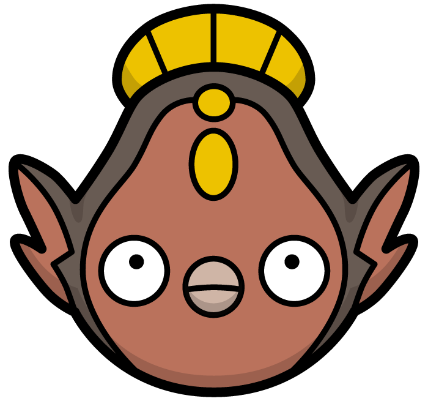

 

  

  <h3 align="center">Swapesy</h3>
  

	
	
	

<!-- TABLE OF CONTENTS -->

  
Table of Contents

  <ol>
    <li>
      <a href="#about-the-project">About The Project</a>
      <ul>
        <li><a href="#built-with">Built With</a></li>
      </ul>
    </li>
    <li><a href="#contributing">Contributing</a></li>
    <li><a href="#contact">Contact</a></li>
  </ol>

<!-- ABOUT THE PROJECT -->
## About The Project
Swapesy is a market place app for selling, trading, and auctioning Pokémon cards!

<!-- CONTRIBUTING -->
## Contributing

If you have a suggestion that would make this better, please fork the repo and create a pull request. You can also simply open an issue with the tag "enhancement".
Don't forget to give the project a star! Thanks again!

1. Fork the Project
2. Create your Feature Branch (`git checkout -b feature/AmazingFeature`)
3. Commit your Changes (`git commit -m 'Add some AmazingFeature'`)
4. Push to the Branch (`git push origin feature/AmazingFeature`)
5. Open a Pull Request

<!-- CONTACT -->
## Contact

Project Manager - [Samuel Ho](https://www.linkedin.com/in/samuelho7/) - email@example.com
UI/UX Designer - [August Beck](https://www.linkedin.com/in/august-beck/) - paler.pumpkin@gmail.com
Architecture Owner - [Jacob Davis](https://www.linkedin.com/in/jacobroyaldavis/) - jakedavisemail@gmail.com
Fullstack Engineer - [Alex Libacova](https://www.linkedin.com/in/alex-libacova/) - libacova.a@gmail.com
Fullstack Engineer - [Britta Moore](https://www.linkedin.com/in/britta-moore/) - email@example.com
Fullstack Engineer - [Mark Yun](https://www.linkedin.com/in/mark-yun-026487268/) - markyun514@gmail.com

<!-- ACKNOWLEDGMENTS -->
## Acknowledgments

* [Img Shields](https://shields.io)
* [React Icons](https://react-icons.github.io/react-icons/search)

(<a href="#readme-top">back to top</a>)

